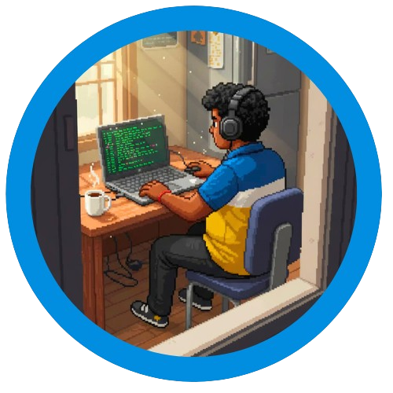

# 👋 Hi, I’m Mohit Kadu (LoyalManuka) 

💻 **Web Developer | AI-Assisted Coder | UI/UX Enthusiast**  
🎯 Passionate about building responsive websites, experimenting with creative projects,  
and exploring how AI can assist coding workflows.  

---

## 🚀 About Me
- 🔭 Currently working on: **AetherSurf** (AI-powered search browser) & **StudKits** (student project manager).  
- 🌱 Learning: **React, TypeScript, and UI/UX design in Figma**.  
- 🤝 Open to: Collaborating on web dev, frontend projects, or creative side-projects.  
- 🎨 Hobbies: Music, video editing, photography, chess, and drawing.  
- ⚡ Fun Fact: I don’t wait for fun — I create it!  

---
## 🌐 Socials:
      

---

## 🖥️ Languages

## 🏗️ Frameworks

## 📚 Libraries

## ⚙️ Tools

  

---

## 📌 Featured Projects  

### 🔹 [Portfolio Website](https://mohitkaduportfolio.netlify.app/) <-- Click Title To View 
Personal portfolio built with HTML & CSS. Dark-themed, responsive, and showcases my projects and design style.  
**Tech:**    

---

### 🔹 [StudKits](https://studkits.vercel.app/) <-- Click Title To View 
A student project manager built with TypeScript + React + Firebase. Helps track assignments and deadlines.  
**Tech:**     

---

### 🔹 AetherSurf *(in progress)*  
An **AI-powered browser** that searches with OpenAI/Ollama and displays results in multiple formats (text, images, videos, websites). Includes search history, model toggle, and a modern UI.  
**Tech:**    

---

## 📊 GitHub Stats  
    

---

## 🏆 GitHub Trophies

---

## 📫 Connect with Me  
- 🌐 Portfolio: [mohitkaduportfolio.netlify.app](https://mohitkaduportfolio.netlify.app/)  
- 💼 LinkedIn: [Mohit Kadu](https://www.linkedin.com/in/mohit-kadu-856410243)  
- 📷 Instagram: [@loyalmanuka](https://www.instagram.com/loyalmanuka/)
---

✨ *“Code with logic, design with creativity, and build with passion.”*
